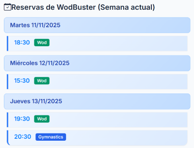
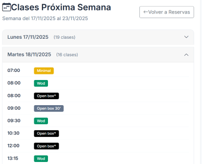

# WodBooker - The WodBuster AutoBooker

## Overview

This Flask application allows WodBuster users to create booking requests which will be performed on their behalf as soon as possible.

## Features

- Automatically book a class at the desired timeslot.
- The bookings list is ordered by day and time.
- If you are in waiting list, as soon as there is a free slot the app will book it for you.
- Wodbuster bookings can be synced to see at a glance the real bookings. Useful if you did manual bookings in wodbuster.
- Next week classes can be viewed in advance. Useful to book special classes in advance, if your box has a lot of rotation (minimal, endurance, gap, hyrox, and so on).
- (Optional) Receive email notifications on successful / failed bookings.
- (Optional) Receive push notifications before each class (15m, 30m, 60m before).

## Screenshots

| Homescreen | Current week bookings | Next week classes |
| :---: | :---: | :---: |
| [](images/wb_homescreen.png) | [](images/wb_current_week.png) | [](images/wb_next_week.png) |


## How to use

Users has to authenticate with the app using **their WodBuster credentials**. The app will check this credentials with WodBuster and will allow users to sign in only when the credentials are valid.

Once logged in, users are allowed to create booking requests. To do so, they are required to introduce:

* Day of week: The day of the week the booking is intended to.
* Hour: The hour of the day the booking is intented to.
* WodBuster box URL: Every box has a different WodBuster URL. Users are required to introduce the one specific to their box. This is required for users with access to multiple boxes.
* Booking opening day: The day when the bookings are opened.
* Booking opening hour: The time of the above day when the first booking attempt should be executed. 

Once the request is created, a thread will take care of it by:

1. Waiting for the booking is available taking into account "Days in advance" and "Booking opening hour" parameters
2. Attempting the booking when the booking is supposed to be ready
3. If the day has not been loaded, the thread will connect to the SSE (Server Side Events) server to listen until the classes have been loaded.
4. If the day has been loaded but booking is not available yet, the thread will wait unitl the class is available. 
5. Once the booking has been performed, the thread will execute the whole process again for the same day of the next week.

## Running in docker

### Requirements

Install docker

### Setup

1. **Set up environment variables**: Whether export the variables in your shell (.zshrc, .bashrc) or create a `.env` file:

```bash
# Email related settings
EMAIL_USER=your-email@example.com
EMAIL_PASSWORD=your-email-password
EMAIL_SENDER=your-email@example.com
EMAIL_HOST=smtp.example.com

# Users in this list will have priority over other users (for conflicting bookings)
PRIORITY_USERS_EMAILS=${PRIORITY_USERS_EMAILS}

# Whitelist. ONLY users in this list will be allowed to DO automatic bookings.
# Other users can only list active bookings and next week classes.
BOOKING_WHITELIST_EMAILS=${BOOKING_WHITELIST_EMAILS}

# Push notifications related variables
VAPID_PUBLIC_KEY=your-vapid-public-key
VAPID_PRIVATE_KEY=your-vapid-private-key
VAPID_CLAIM_EMAIL=mailto:your-email@example.com
```

2. **Run with Docker Compose**: The easiest way to run the project is using docker compose:

```bash
docker compose up -d --build
```

Once the build finishes the containers should be up & running.

The application will be accessible at:

- 127.0.0.1:5100
- 127.0.0.1:80
- 127.0.0.1:443

To access from outside your local network you'll need to open two ports:

- Open the 443 port in your router and forward it to `127.0.0.1:443`.
- Open the 80 port in your router and forward it to `127.0.0.1:80`. This will be used for letsencrypt to renew the certificate (optional but highly recommended).

For the letsencrypt configuration see the last section of this README.

## SSL certificate for nginx

The first time we run wodbooker nginx container we need to run this:

```bash
/usr/bin/docker exec -ti nginx-wodbooker certbot --nginx -d wodbooker.yourdomain.com
```

The above command will deploy the letsencrypt certificate for the first time.

From then on, the certificate only needs to be renewed every three months. This can be automated in crontab:

```bash
crontab -e
```

Add this line:

```bash
0 0 * * * /usr/bin/docker exec -ti nginx-wodbooker certbot renew --quiet
```

## Push Notifications

Push notifications are implemented to remind users before their booked classes. Users can enable push notifications and choose to receive reminders at 1 hour, 30 minutes, and/or 15 minutes before a class.

The push notifications will automatically be sent based on the user's preferences and their confirmed, non-cancelled bookings.

:important: The users must enable push notifications through the "Preferencias" menu.

### Technical setup for push notifications

#### 1. Generate VAPID Keys

VAPID (Voluntary Application Server Identification) keys are required for push notifications. Use the provided script to generate them:

```bash
python generate_vapid_keys.py your-email@example.com
```

This will output the `VAPID_PUBLIC_KEY`, `VAPID_PRIVATE_KEY`, and `VAPID_CLAIM_EMAIL` variables.

#### 2. Set Environment Variables

Add the generated keys to your environment variables. If you're using Docker Compose, place them in your `.env` file.

```bash
VAPID_PUBLIC_KEY=your-generated-public-key
VAPID_PRIVATE_KEY=your-generated-private-key
VAPID_CLAIM_EMAIL=mailto:your-email@example.com
```

**Important**: The application automatically handles the VAPID key format conversion. You do **not** need to manually convert the keys; use them exactly as generated by the script.

#### 3. Install Dependencies

Ensure all required Python packages are installed. If you are running the application with Docker, this will be handled automatically. If you are running it locally, make sure to install the packages from `requirements.txt`:

```bash
pip install -r requirements.txt
```

#### 4. Restart the Application

After setting the environment variables, restart the application for the changes to take effect.

```bash
docker compose up -d --build
```

## SSL certificate for nginx

The first time we run wodbooker nginx container we need to run this:

```bash
/usr/bin/docker exec -ti nginx-wodbooker certbot --nginx -d wodbooker.yourdomain.com
```

The above command will deploy the letsencrypt certificate for the first time.

From then on, the certificate only needs to be renewed every three months. This can be automated in crontab:

```bash
crontab -e
```

Add this line:

```bash
0 0 * * * /usr/bin/docker exec -ti nginx-wodbooker certbot renew --quiet
```