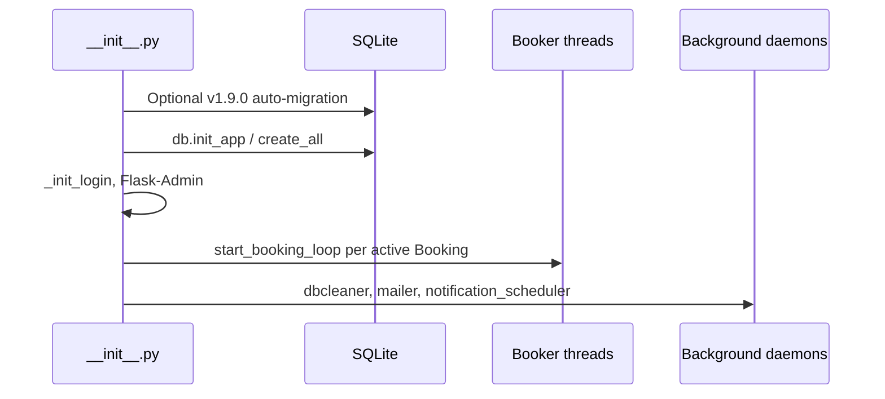
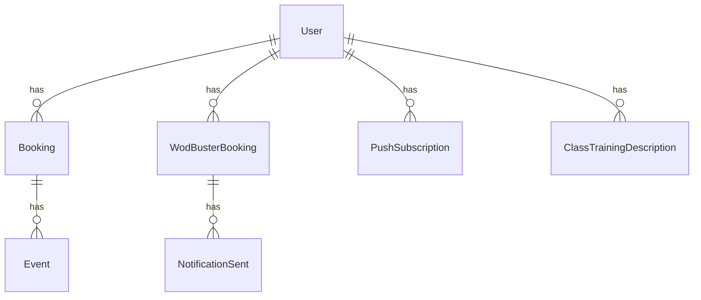

# WodBooker — Architecture

## Overview

WodBooker is a Flask + Flask-Admin application that authenticates users against WodBuster, stores their session cookies, and runs background **Booker** threads to auto-reserve recurring class slots. Optional email and Web Push notifications inform users of booking outcomes and upcoming classes.

Application bootstrap happens at **import time** in `wodbooker/__init__.py`. `app.py` only imports `app` and runs the dev server.

## Startup sequence

## HTTP routes

### Flask routes (`__init__.py`)

| Path | Methods | Auth | Purpose |
|------|---------|------|---------|
| `/api/push/vapid-public-key` | GET | Public | VAPID public key for Web Push |
| `/api/push/subscribe` | POST | Login, CSRF exempt | Register push subscription |
| `/api/push/unsubscribe` | POST | Login, CSRF exempt | Remove subscription |
| `/api/push/test` | POST | Login, CSRF exempt | Test push (5s delayed thread) |
| `/api/wodbuster/sync` | POST | Login, CSRF exempt | AJAX WodBuster booking sync |
| `/weekly-classes` | GET | Login | Weekly schedule page |

### Flask-Admin (`views.py`, mounted at `/`)

| Path | Purpose |
|------|---------|
| `/` | Index → login or bookings list |
| `/login/`, `/logout/` | WodBuster credential login |
| `/booking/` | Reservas list (main dashboard) |
| `/booking/new/`, `/edit/`, `/delete/` | Booking CRUD |
| `/booking/active` | Toggle `is_active` + start/stop Booker |
| `/booking/sync-wodbuster-bookings` | Manual sync |
| `/booking/cancel-wodbuster-booking` | Cancel synced class |
| `/user/edit/` | Preferencias (notifications, sync flags) |
| `/event/` | Hidden read-only event log |

Legacy `/admin/*` URLs redirect to `/` via `redirect_admin` before_request hook.

## Background threads

| Thread name | Source | Interval | Purpose |
|-------------|--------|----------|---------|
| `Booker {id}` | `booker.start_booking_loop` | Continuous loop | Auto-book one `Booking` |
| `dbcleaner` | `__init__.py` | 24 hours | Delete `Event` rows older than 15 days |
| `mailer` | `mailer.process_maling_queue` | Blocking on queue | Send SMTP emails |
| `notification_scheduler` | `notification_scheduler._notification_scheduler_loop` | 60 seconds | Class reminder push (60/30/15 min) |

No APScheduler — all timing uses `time.sleep()` in daemon threads.

## Data model

SQLite file: `wodbooker/db.sqlite` (URI set in `__init__.py`).

| Model | Table | Purpose |
|-------|-------|---------|
| `User` | `user` | Auth, cookies, notification/sync preferences |
| `Booking` | `booking` | Recurring auto-book rule (dow, time, url, offset, available_at) |
| `Event` | `event` | Per-booking audit log |
| `WodBusterBooking` | `wodbuster_booking` | Synced real bookings from WodBuster API |
| `PushSubscription` | `push_subscription` | Web Push endpoints |
| `NotificationSent` | `notification_sent` | Dedup for class reminders |
| `ClassTrainingDescription` | `class_training_description` | Cached WOD board text |

## Authentication

1. User submits WodBuster email/password on `/login/`.
2. `refresh_scraper(email, password)` authenticates via `cloudscraper`.
3. `User` row created/updated with pickled cookies in `User.cookie`.
4. Flask-Login session (`remember=True`) keyed by `User.id`.
5. Each request: `check_session_expired` unpickles cookies and validates `.WBAuth` expiry.
6. `User.force_login=True` (set by Booker on credential failures) forces logout on next request.

## Environment variables (code behavior)

| Variable | Module | Effect |
|----------|--------|--------|
| `SECRET_KEY` | `__init__.py` | Flask session signing |
| `VAPID_PUBLIC_KEY`, `VAPID_PRIVATE_KEY`, `VAPID_CLAIM_EMAIL` | `__init__.py` | Web Push; missing keys → API 500 |
| `BOOKING_WHITELIST_EMAILS` | `booker.py` | Space-separated; if set, only listed emails can auto-book |
| `PRIORITY_USERS_EMAILS` | `booker.py` | Non-priority users sleep 1s before booking |
| `EMAIL_USER`, `EMAIL_PASSWORD`, `EMAIL_SENDER`, `EMAIL_HOST` | `mailer.py` | SMTP for notification emails |
| `RECAPTCHA_PUBLIC_KEY`, `RECAPTCHA_PRIVATE_KEY` | `__init__.py` | Config only (login reCAPTCHA commented out) |

Ops-only (Docker, nginx, SSL): see [README.md](../README.md).

## Logging

| Logger / file | Purpose |
|---------------|---------|
| `logs/wodbooker.log` | General app logs (daily rotation, 7 backups) |
| `logs/wodbooker-high-level.log` | Business events (`high_level` logger) |
| Training descriptions | `training_descriptions` logger (file-only) |

## Migrations

- Versioned SQL: `migrations/vX.Y.Z/*.sql`
- Apply: `python migrate.py vX.Y.Z` from repo root
- DB path resolution: `instance/db.sqlite` → `db.sqlite` → `wodbooker/db.sqlite`
- **Auto on startup**: only v1.9.0 if `user.push_notifications_enabled` column missing

Existing versions: v1.6.0 through v1.12.0 (see `migrations/` folder).

## Module responsibilities

| File | Role |
|------|------|
| `wodbooker/__init__.py` | App factory, config, routes, admin mount, startup threads |
| `wodbooker/booker.py` | Booker threads, waiters, sync helpers |
| `wodbooker/scraper.py` | WodBuster HTTP/SSE client |
| `wodbooker/models.py` | SQLAlchemy models |
| `wodbooker/views.py` | Login, Flask-Admin CRUD, custom endpoints |
| `wodbooker/notification_scheduler.py` | Push reminder loop |
| `wodbooker/push_notifications.py` | pywebpush send helpers |
| `wodbooker/mailer.py` | Email queue + templates |
| `wodbooker/exceptions.py` | Domain errors |
| `wodbooker/constants.py` | `EventMessage`, mail strings, UI defaults |

## Related docs

- [booking-flow.md](booking-flow.md) — Booker thread internals
- [wodbuster-integration.md](wodbuster-integration.md) — Scraper API and exceptions
- [AGENTS.md](../AGENTS.md) — Agent quick start
